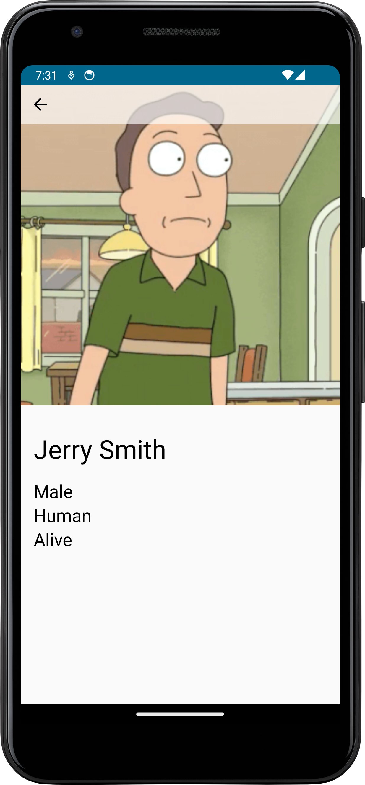

# Rick and Morty App

A simple app that pulls character data from the [Rick and Morty
API](https://rickandmortyapi.com/about) and displays it in a grid view.
You can click on the thumbnails to get more detail about a specific
character.

The code is intended to showcase a simple list/detail Android app that
makes mainstream and modern tech choices ("best practices") in Android
development as of Q4 2023. (Google's excellent [Now in Android
App](https://github.com/android/nowinandroid#now-in-android-app)
reference does this too, but is a more complex example.)

## Technical Choices

- ["Offline first"](https://developer.android.com/topic/architecture/data-layer/offline-first) approach
- [Retrofit](https://square.github.io/retrofit/) w/ [Kotlin Serialization](https://kotlinlang.org/docs/serialization.html)
- [Room](https://developer.android.com/training/data-storage/room)

- Kotlin
- Compose
- [MVVM w/ uni-directional data flow](https://www.youtube.com/watch?v=qX6zmKY4KP0&t=72s)
- [Loading/Content/Error](https://medium.com/trendyol-tech/simple-ui-problem-states-loading-error-empty-and-content-cbf924b39fcb) pattern in UI & Data layers

- [Navigation](https://developer.android.com/jetpack/androidx/releases/navigation)
- [Hilt](https://developer.android.com/training/dependency-injection/hilt-android) with [KSP](https://dagger.dev/dev-guide/ksp.html)

## To do
- Broader and more elegant use of MaterialTheme
- Tests

